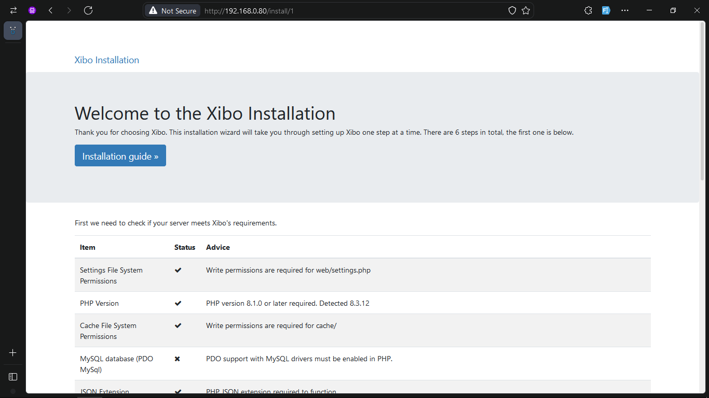
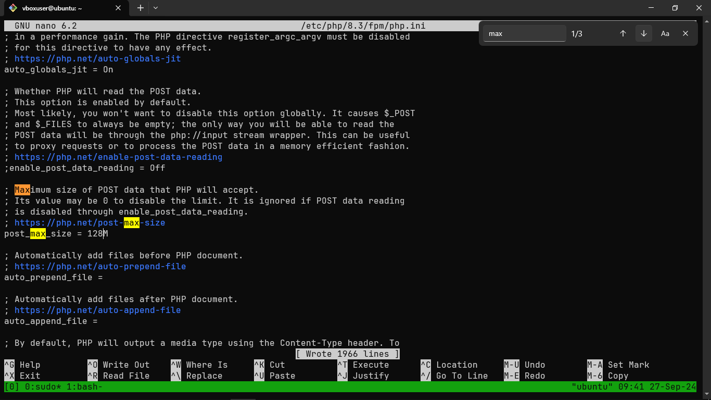
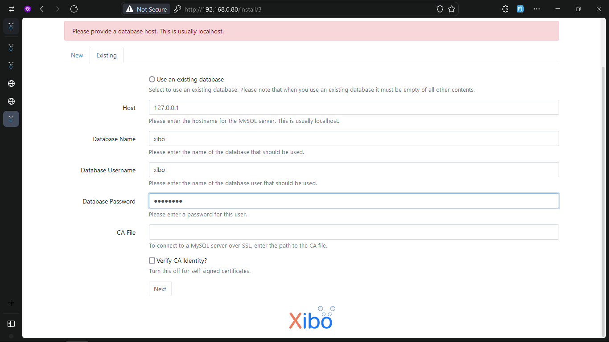
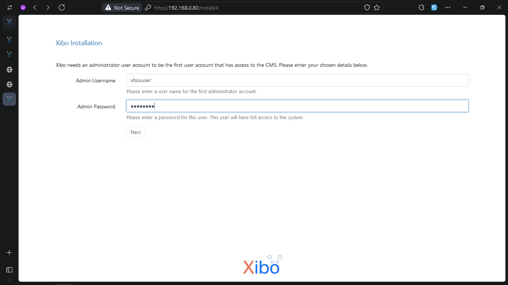
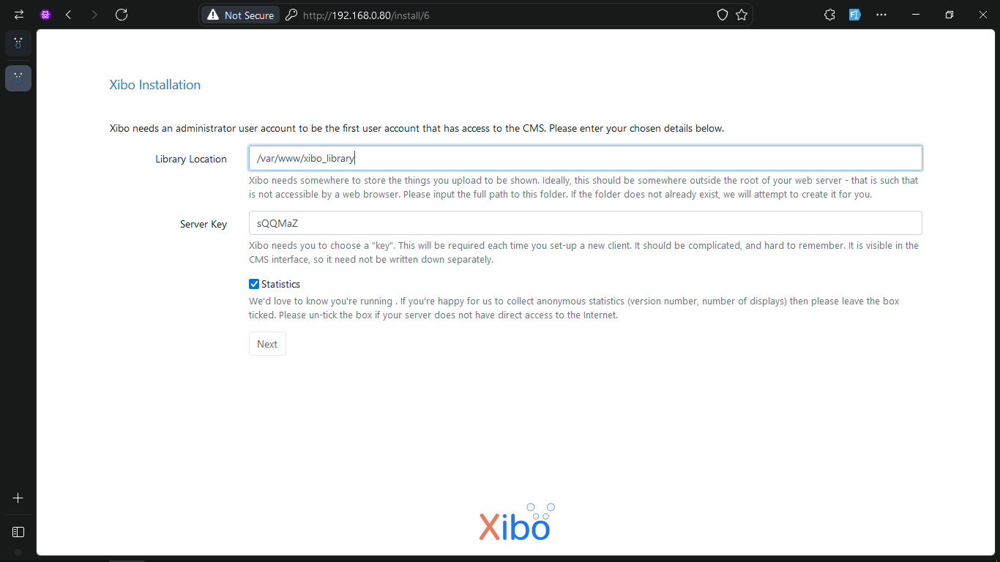
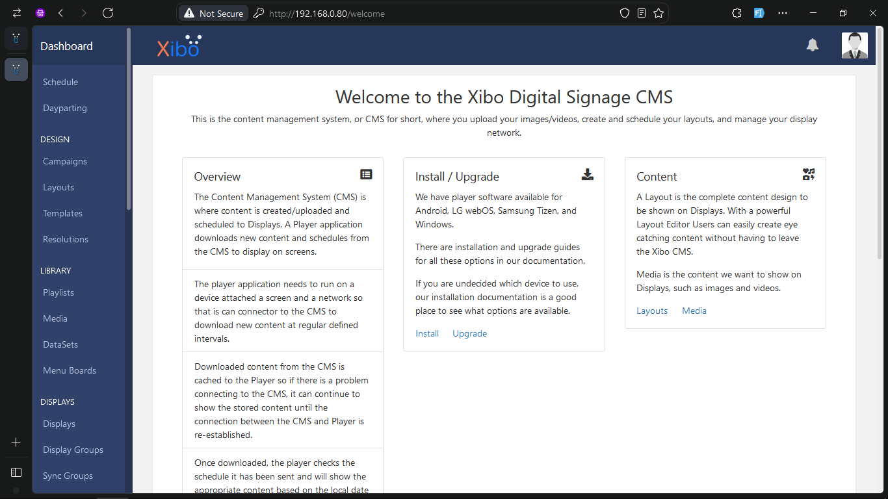
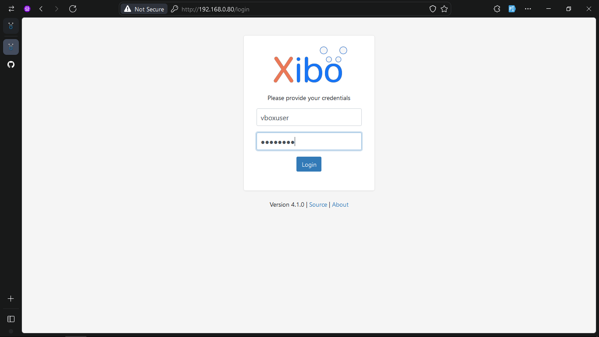
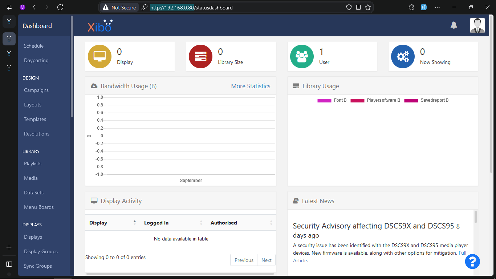
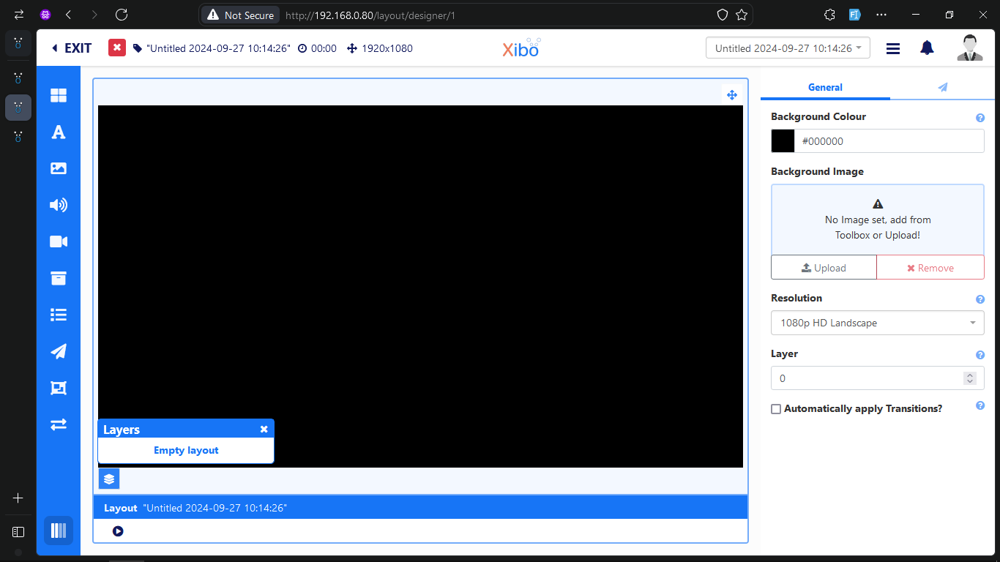

# Guia de Configuração do Xibo 4.1

Este guia fornece instruções passo a passo para configurar o Xibo 4.1 num sistema Ubuntu.

## Índice

1. [Pré-requisitos](#pré-requisitos)
2. [Instalação de Dependências](#instalação-de-dependências)
3. [Configuração da Base de Dados](#configuração-da-base-de-dados)
4. [Instalação do Xibo CMS](#instalação-do-xibo-cms)
5. [Configuração do Apache](#configuração-do-apache)
6. [Configuração da Firewall](#configuração-da-firewall)
7. [Configuração Pós-Instalação](#configuração-pós-instalação)
8. [Referências](#referências)

## Pré-requisitos

Antes de começar, certifique-se de que tem um sistema Ubuntu atualizado:

```bash
sudo apt-get update
sudo apt-get upgrade -y
```

Instale as ferramentas de rede:

```bash
sudo apt-get install -y net-tools
```

## Instalação de Dependências

1. Adicione o repositório PHP:

```bash
sudo add-apt-repository ppa:ondrej/php
```

2. Instale o Apache, PHP e as extensões necessárias:

```bash
sudo apt-get install -y apache2 libapache2-mod-php php8.3 php8.3-cli php8.3-common php8.3-fpm php8.3-mysql php-sqlite3 php8.3-pgsql php8.3-zip php8.3-gd php8.3-mbstring php8.3-curl php8.3-xml php8.3-bcmath php8.3-tokenizer php8.3-gd php8.3-intl php8.3-zip php8.3-tidy php8.3-imagick php8.3-soap php8.3-zmq
```

## Configuração da Base de Dados

1. Instale e configure o MariaDB:

```bash
sudo apt-get install -y mariadb-server
sudo mysql_secure_installation
```

2. Crie a base de dados e o utilizador para o Xibo:

```bash
sudo mysql -u root -p
```

No prompt do MySQL, execute:

```sql
CREATE DATABASE xibo;
GRANT ALL ON xibo.* TO 'xibo'@'localhost' IDENTIFIED BY 'password';
FLUSH PRIVILEGES;
exit;
```

## Instalação do Xibo CMS

1. Descarregue e extraia o Xibo CMS:

```bash
sudo apt-get install wget
wget https://github.com/xibosignage/xibo-cms/releases/download/4.1.0/xibo-cms-4.1.0.tar.gz
tar -zxvf xibo-cms-4.1.0.tar.gz
sudo mv xibo-cms-4.1.0 /var/www/xibo
```

2. Defina as permissões corretas:

```bash
sudo chown -R www-data:www-data /var/www/xibo
```

## Configuração do Apache

1. Ative o módulo rewrite:

```bash
sudo a2enmod rewrite
sudo systemctl restart apache2
```

2. Crie um ficheiro de configuração para o Xibo:

```bash
sudo nano /etc/apache2/sites-available/xibo.conf
```

Adicione o seguinte conteúdo:

```apache
<VirtualHost *:80>
    DocumentRoot /var/www/xibo/web
    <Directory /var/www/xibo/web>
        Options -Indexes +FollowSymLinks +MultiViews
        AllowOverride All
        Require all granted
    </Directory>
    ErrorLog ${APACHE_LOG_DIR}/xibo.errors.log
    CustomLog ${APACHE_LOG_DIR}/xibo.requests.log combined
</VirtualHost>
```

3. Desative o site padrão e ative o Xibo:

```bash
sudo a2dissite 000-default.conf
sudo a2ensite xibo.conf
sudo systemctl restart apache2
```

## Configuração da Firewall

Ative as regras necessárias na firewall:

```bash
sudo ufw enable Apache
sudo ufw enable OpenSSH
```

## Configuração Pós-Instalação

1. Aceda à página de instalação em `http://<127.0.0.1>/install/1` e siga as instruções para concluir a configuração.



2. Se necessário, ajuste as configurações do PHP, segundo a pagina de inicial:

```bash
sudo cp /etc/php/8.3/fpm/php.ini /etc/php/8.3/fpm/php.TEMPLATE.ini
sudo nano /etc/php/8.3/fpm/php.ini
```



4. Configurar a o acesso a base de dados:



5. Configuarar o Utilizador admin do XIBO



6. Crie uma pasta de biblioteca para a aplicação:

```bash
sudo mkdir /var/www/xibo_library
sudo chown -R www-data:www-data /var/www/xibo_library
```



6. Feito, Efectue o login:





7. ✨✨🎉🎉🎉 Vamos brincar, 😁🤦‍♀️



## Referências

- [ACE Cloud Hosting - How To Install Xibo on Ubuntu 20.04](https://customer.acecloudhosting.com/index.php/knowledgebase/221/How-To-Install-Xibo-on-Ubuntu-20.04.html)
- [GitHub - Xibo](https://github.com/xibosignage/xibo/)
